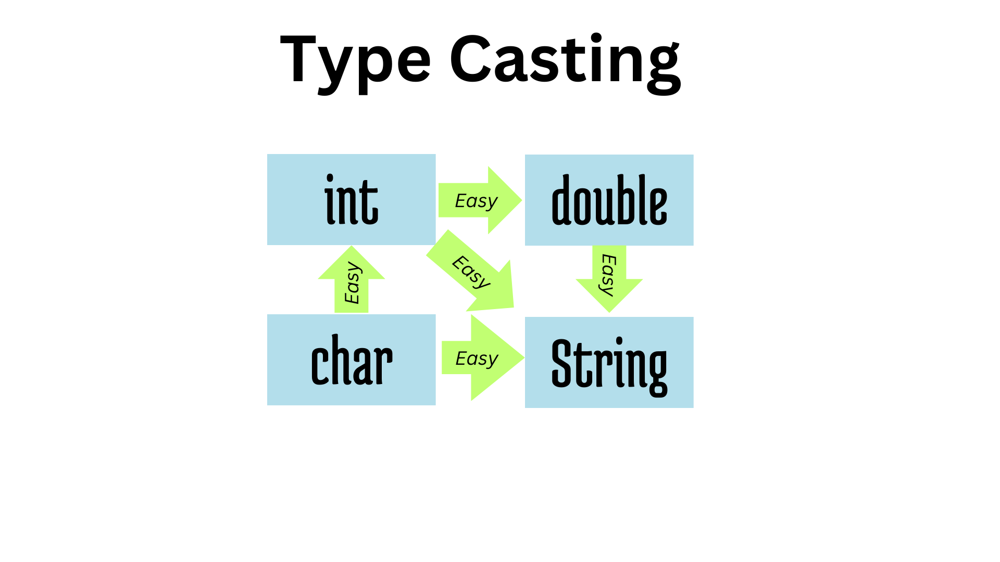
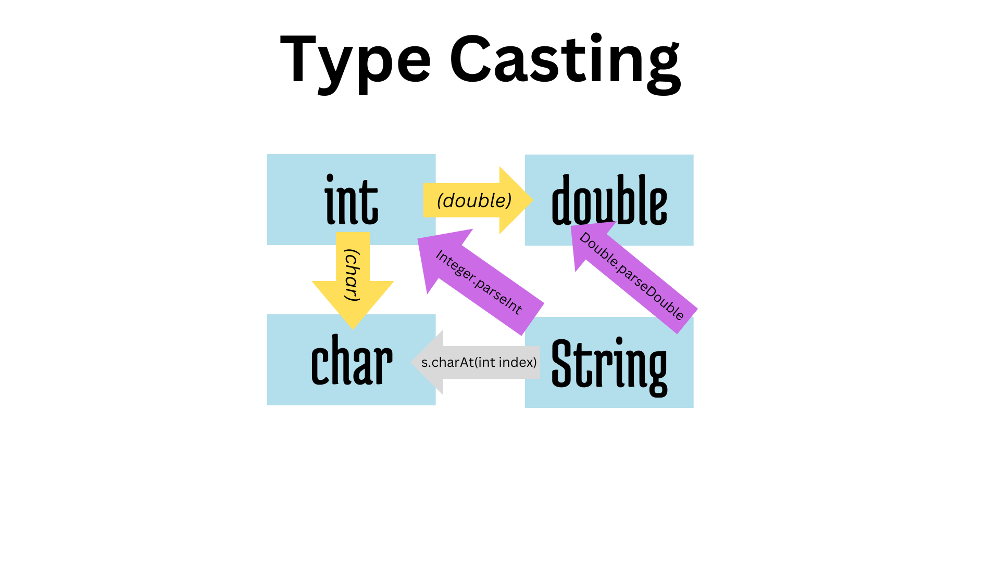

## Getting Started
Welcome here! 😊

This is the code for my video: [Java Bootcamp Express 🚀: Learn Java in 12 Minutes!](https://youtu.be/xIPODmdMp-8);

It contains my summary of a 2-week intensive Java bootcamp (MATSE Java Blockkurs) 🚀📚

*Many of the functions are currently commented out. In most IDEs, you can quickly uncomment multiple lines of code by using the keyboard shortcut Ctrl + Shift + forward slash (/). 🧑‍💻*

Enjoy! 🎉👍

# Index: 
- 0- Hello World
- 1- Basic Concepts (Comments, Datatypes, Casting, Input/Output)
- 2- Loops, exceptions, Arrays
- 3- Classes, Objects

Copyright © Marine Raimbault 2023

These images and this repository are the intellectual property of Marine Raimbault and are provided solely for educational and teaching purposes. Users are prohibited from using them for commercial purposes, redistributing or selling them, or modifying them without prior permission. When using them for educational purposes, please provide proper attribution to Marine Raimbault as the creator.

For inquiries or permission requests, please contact me.

## Folder Structure (Specific to Visual Studio Code)

The workspace contains two folders by default, where:

- `src`: the folder to maintain sources
- `lib`: the folder to maintain dependencies

Meanwhile, the compiled output files will be generated in the `bin` folder by default.

> If you want to customize the folder structure, open `.vscode/settings.json` and update the related settings there.

## Dependency Management

The `JAVA PROJECTS` view allows you to manage your dependencies. More details can be found [here](https://github.com/microsoft/vscode-java-dependency#manage-dependencies).
